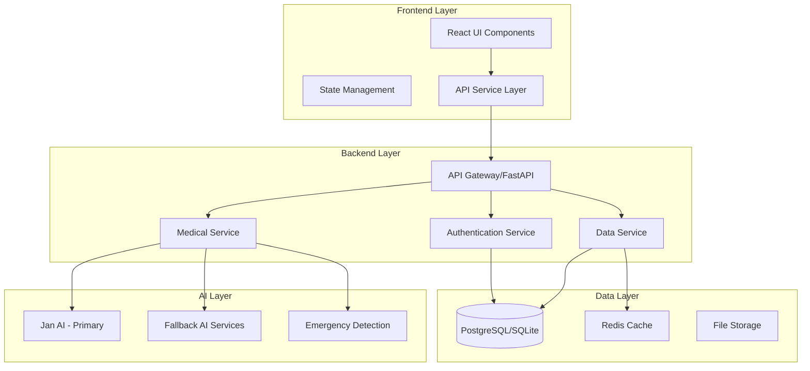

# Design Document

## Overview

This design document outlines the architecture and implementation approach for enhancing the "My Dr" AI-powered medical assistant from a functional prototype to a production-ready medical consultation platform. The design builds upon the existing React frontend and FastAPI backend while addressing critical gaps in AI integration, data persistence, user management, and medical feature completeness.

The enhanced system will provide reliable medical consultations through local AI integration, comprehensive health data management, advanced symptom analysis, and a secure, scalable architecture suitable for production deployment.

## Architecture

### High-Level Architecture



### System Components

#### Frontend Architecture
- **React 18** with modern hooks and context
- **Component-based architecture** with reusable medical UI components
- **State management** using React Context and custom hooks
- **Real-time updates** with WebSocket connections for chat
- **Progressive Web App** features for mobile optimization
- **Accessibility-first design** with WCAG 2.1 AA compliance

#### Backend Architecture
- **FastAPI** with async/await for high performance
- **Microservice-oriented** design with clear separation of concerns
- **Database abstraction layer** supporting both SQLite and PostgreSQL
- **Comprehensive error handling** with graceful degradation
- **Security middleware** with authentication and rate limiting

#### AI Integration Architecture
- **Primary AI**: Jan AI (Llama 3.2 3B) for local, private consultations
- **Fallback chain**: Multiple AI providers for reliability
- **Emergency detection**: Pattern matching for urgent medical situations
- **Response validation**: Medical accuracy and safety checks

## Components and Interfaces

### Core Components

#### 1. Enhanced AI Service Manager
```python
class AIServiceManager:
    """Manages multiple AI providers with intelligent fallback"""
    
    def __init__(self):
        self.primary_service = JanAIService()
        self.fallback_services = [PerplexityService(), HuggingFaceService()]
        self.emergency_detector = EmergencyDetector()
    
    async def get_medical_consultation(self, message: str, user_context: dict) -> ConsultationResponse:
        """Get medical consultation with fallback handling"""
        
    async def detect_emergency(self, message: str) -> EmergencyAssessment:
        """Detect potential medical emergencies"""
        
    def validate_response(self, response: str) -> ValidationResult:
        """Validate AI response for medical accuracy"""
```

#### 2. Medical Data Manager
```python
class MedicalDataManager:
    """Handles all medical data operations"""
    
    async def save_consultation(self, user_id: str, consultation: Consultation) -> str:
        """Save consultation with full context"""
        
    async def get_medical_history(self, user_id: str, filters: dict) -> List[MedicalRecord]:
        """Retrieve filtered medical history"""
        
    async def analyze_health_patterns(self, user_id: str) -> HealthAnalytics:
        """Generate health insights from user data"""
        
    async def check_drug_interactions(self, medications: List[str]) -> InteractionReport:
        """Check for drug interactions"""
```

#### 3. Symptom Analysis Engine
```python
class SymptomAnalyzer:
    """Advanced symptom analysis and triage"""
    
    def analyze_symptoms(self, symptoms: SymptomInput) -> SymptomAnalysis:
        """Analyze symptoms for severity and recommendations"""
        
    def calculate_urgency_score(self, symptoms: List[str]) -> UrgencyScore:
        """Calculate medical urgency from 1-10"""
        
    def generate_recommendations(self, analysis: SymptomAnalysis) -> List[Recommendation]:
        """Generate specific medical recommendations"""
```

#### 4. User Authentication Service
```python
class AuthenticationService:
    """Handle user authentication and session management"""
    
    async def authenticate_user(self, token: str) -> User:
        """Authenticate Firebase token"""
        
    async def create_user_session(self, user: User) -> SessionToken:
        """Create secure session"""
        
    def validate_session(self, token: str) -> bool:
        """Validate active session"""
```

### Frontend Components

#### 1. Enhanced Chat Interface
```jsx
const EnhancedChatInterface = () => {
    // Real-time chat with typing indicators
    // Voice input/output integration
    // Message persistence and history
    // Emergency alert handling
    // Connection status monitoring
}
```

#### 2. Medical History Dashboard
```jsx
const MedicalHistoryDashboard = () => {
    // CRUD operations for medical records
    // Timeline view of health events
    // Search and filter capabilities
    // Export functionality
    // Data visualization
}
```

#### 3. Symptom Checker Interface
```jsx
const SymptomChecker = () => {
    // Guided symptom input form
    // Real-time analysis feedback
    // Urgency level display
    // Recommendation presentation
    // Follow-up scheduling
}
```

#### 4. Health Analytics Dashboard
```jsx
const HealthAnalyticsDashboard = () => {
    // Interactive charts and graphs
    // Trend analysis visualization
    // Health insights presentation
    // Goal tracking interface
    // Report generation
}
```

## Data Models

### Enhanced Database Schema

#### Users Table
```sql
CREATE TABLE users (
    id UUID PRIMARY KEY DEFAULT gen_random_uuid(),
    firebase_uid VARCHAR(255) UNIQUE NOT NULL,
    email VARCHAR(255) UNIQUE NOT NULL,
    display_name VARCHAR(255),
    created_at TIMESTAMP WITH TIME ZONE DEFAULT NOW(),
    updated_at TIMESTAMP WITH TIME ZONE DEFAULT NOW(),
    last_login TIMESTAMP WITH TIME ZONE,
    is_active BOOLEAN DEFAULT TRUE,
    preferences JSONB DEFAULT '{}',
    privacy_settings JSONB DEFAULT '{}'
);
```

#### Medical Records Table
```sql
CREATE TABLE medical_records (
    id UUID PRIMARY KEY DEFAULT gen_random_uuid(),
    user_id UUID REFERENCES users(id) ON DELETE CASCADE,
    record_type VARCHAR(50) NOT NULL, -- 'visit', 'diagnosis', 'medication', 'test'
    title VARCHAR(255) NOT NULL,
    description TEXT,
    date_recorded DATE NOT NULL,
    healthcare_provider VARCHAR(255),
    medications JSONB DEFAULT '[]',
    test_results JSONB DEFAULT '{}',
    attachments JSONB DEFAULT '[]',
    created_at TIMESTAMP WITH TIME ZONE DEFAULT NOW(),
    updated_at TIMESTAMP WITH TIME ZONE DEFAULT NOW()
);
```

#### Conversations Table
```sql
CREATE TABLE conversations (
    id UUID PRIMARY KEY DEFAULT gen_random_uuid(),
    user_id UUID REFERENCES users(id) ON DELETE CASCADE,
    title VARCHAR(255),
    consultation_type VARCHAR(50) DEFAULT 'general',
    status VARCHAR(20) DEFAULT 'active', -- 'active', 'archived', 'emergency'
    created_at TIMESTAMP WITH TIME ZONE DEFAULT NOW(),
    last_message_at TIMESTAMP WITH TIME ZONE DEFAULT NOW(),
    metadata JSONB DEFAULT '{}'
);
```

#### Messages Table
```sql
CREATE TABLE messages (
    id UUID PRIMARY KEY DEFAULT gen_random_uuid(),
    conversation_id UUID REFERENCES conversations(id) ON DELETE CASCADE,
    content TEXT NOT NULL,
    sender VARCHAR(10) NOT NULL, -- 'user', 'ai'
    message_type VARCHAR(20) DEFAULT 'text', -- 'text', 'voice', 'image'
    ai_model VARCHAR(50),
    confidence_score FLOAT,
    emergency_flag BOOLEAN DEFAULT FALSE,
    created_at TIMESTAMP WITH TIME ZONE DEFAULT NOW(),
    metadata JSONB DEFAULT '{}'
);
```

#### Health Analytics Table
```sql
CREATE TABLE health_analytics (
    id UUID PRIMARY KEY DEFAULT gen_random_uuid(),
    user_id UUID REFERENCES users(id) ON DELETE CASCADE,
    metric_type VARCHAR(50) NOT NULL, -- 'symptom_frequency', 'consultation_pattern'
    metric_value JSONB NOT NULL,
    date_recorded DATE NOT NULL,
    created_at TIMESTAMP WITH TIME ZONE DEFAULT NOW()
);
```

### API Response Models

#### Consultation Response
```python
class ConsultationResponse(BaseModel):
    reply: str
    confidence_score: float
    emergency_detected: bool
    urgency_level: int  # 1-10 scale
    recommendations: List[str]
    follow_up_needed: bool
    timestamp: datetime
    ai_model_used: str
```

#### Symptom Analysis Response
```python
class SymptomAnalysisResponse(BaseModel):
    urgency_score: int  # 1-10
    severity_level: str  # 'low', 'moderate', 'high', 'emergency'
    possible_conditions: List[str]
    recommendations: List[str]
    red_flags: List[str]
    next_steps: List[str]
    confidence: float
```

#### Health Analytics Response
```python
class HealthAnalyticsResponse(BaseModel):
    consultation_stats: Dict[str, Any]
    symptom_patterns: List[Dict[str, Any]]
    health_trends: List[Dict[str, Any]]
    insights: List[str]
    recommendations: List[str]
    risk_factors: List[str]
```

## Error Handling

### Comprehensive Error Management Strategy

#### 1. AI Service Error Handling
```python
class AIServiceError(Exception):
    """Base exception for AI service errors"""
    pass

class AIServiceUnavailable(AIServiceError):
    """AI service is temporarily unavailable"""
    pass

class AIResponseInvalid(AIServiceError):
    """AI response failed validation"""
    pass

async def handle_ai_service_error(error: AIServiceError, user_message: str) -> str:
    """Handle AI service errors with appropriate fallbacks"""
    if isinstance(error, AIServiceUnavailable):
        return generate_fallback_response(user_message)
    elif isinstance(error, AIResponseInvalid):
        return "I need to think about that more carefully. Could you rephrase your question?"
    else:
        return "I'm having technical difficulties. Please try again in a moment."
```

#### 2. Database Error Handling
```python
async def safe_database_operation(operation: Callable) -> Tuple[bool, Any, Optional[str]]:
    """Safely execute database operations with error handling"""
    try:
        result = await operation()
        return True, result, None
    except IntegrityError as e:
        logger.error(f"Database integrity error: {e}")
        return False, None, "Data validation error occurred"
    except OperationalError as e:
        logger.error(f"Database operational error: {e}")
        return False, None, "Database temporarily unavailable"
    except Exception as e:
        logger.error(f"Unexpected database error: {e}")
        return False, None, "An unexpected error occurred"
```

#### 3. Frontend Error Boundaries
```jsx
class MedicalErrorBoundary extends React.Component {
    constructor(props) {
        super(props);
        this.state = { hasError: false, errorType: null };
    }

    static getDerivedStateFromError(error) {
        return { hasError: true, errorType: error.name };
    }

    componentDidCatch(error, errorInfo) {
        // Log error to monitoring service
        logErrorToService(error, errorInfo);
    }

    render() {
        if (this.state.hasError) {
            return <MedicalErrorFallback errorType={this.state.errorType} />;
        }
        return this.props.children;
    }
}
```

## Testing Strategy

### Comprehensive Testing Approach

#### 1. Backend Testing
```python
# Unit Tests
class TestAIServiceManager:
    async def test_primary_ai_success(self):
        """Test successful primary AI response"""
        
    async def test_fallback_chain(self):
        """Test fallback when primary AI fails"""
        
    async def test_emergency_detection(self):
        """Test emergency situation detection"""

# Integration Tests
class TestMedicalAPI:
    async def test_end_to_end_consultation(self):
        """Test complete consultation flow"""
        
    async def test_data_persistence(self):
        """Test data saving and retrieval"""

# Load Tests
class TestPerformance:
    async def test_concurrent_consultations(self):
        """Test system under concurrent load"""
```

#### 2. Frontend Testing
```javascript
// Component Tests
describe('ChatInterface', () => {
    test('handles AI response correctly', () => {
        // Test AI response handling
    });
    
    test('displays error messages appropriately', () => {
        // Test error state handling
    });
});

// Integration Tests
describe('Medical Features', () => {
    test('symptom checker flow', () => {
        // Test complete symptom checking process
    });
    
    test('medical history management', () => {
        // Test CRUD operations
    });
});

// E2E Tests
describe('User Journey', () => {
    test('complete medical consultation', () => {
        // Test full user journey
    });
});
```

#### 3. AI Response Testing
```python
class TestMedicalAI:
    def test_medical_accuracy(self):
        """Test AI responses for medical accuracy"""
        
    def test_emergency_detection_accuracy(self):
        """Test emergency detection sensitivity and specificity"""
        
    def test_response_safety(self):
        """Test that responses include appropriate disclaimers"""
```

### Testing Data and Scenarios

#### Medical Test Cases
- Common symptoms (headache, fever, cough)
- Emergency scenarios (chest pain, difficulty breathing)
- Chronic condition management
- Medication interactions
- Mental health concerns

#### Edge Cases
- Extremely long symptom descriptions
- Multiple concurrent symptoms
- Vague or unclear symptom descriptions
- Non-medical questions
- Inappropriate content

## Implementation Phases

### Phase 1: Core Infrastructure (Weeks 1-2)
1. **Database Enhancement**
   - Complete schema implementation
   - Migration system setup
   - Data validation layer

2. **AI Service Integration**
   - Jan AI connection stabilization
   - Fallback service implementation
   - Error handling framework

3. **Authentication System**
   - Firebase integration completion
   - Session management
   - Security middleware

### Phase 2: Medical Features (Weeks 3-4)
1. **Enhanced Chat System**
   - Message persistence
   - Conversation management
   - Real-time updates

2. **Symptom Checker**
   - Analysis engine implementation
   - Urgency scoring system
   - Recommendation generation

3. **Medical History**
   - CRUD operations
   - Data visualization
   - Export functionality

### Phase 3: Advanced Features (Weeks 5-6)
1. **Health Analytics**
   - Pattern recognition
   - Trend analysis
   - Insight generation

2. **Drug Interaction System**
   - Medication database integration
   - Interaction checking
   - Safety warnings

3. **Voice Integration**
   - Speech-to-text enhancement
   - Text-to-speech optimization
   - Accessibility improvements

### Phase 4: Production Readiness (Weeks 7-8)
1. **Performance Optimization**
   - Database query optimization
   - Frontend bundle optimization
   - Caching implementation

2. **Security Hardening**
   - Security audit
   - Penetration testing
   - Compliance verification

3. **Deployment Infrastructure**
   - CI/CD pipeline
   - Monitoring setup
   - Backup systems

This design provides a comprehensive roadmap for transforming the "My Dr" application into a production-ready medical assistant platform while maintaining the existing architecture and building upon current strengths.